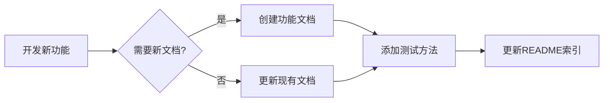

# 文档整理与维护规范

> 适用于所有软件项目的文档管理指南
> 请将本文档链接："https://github.com/LemonCANDY42/vibe-coding-rules/blob/main/%E6%96%87%E6%A1%A3%E6%95%B4%E7%90%86%E8%AF%B4%E6%98%8E.md"放到README.md中，确保agent时刻按照本文档原则维护项目文档结构

## 核心原则

1. **功能优先** - 保留功能文档，删除修复记录
2. **避免冗余** - 相同概念合并到统一文档
3. **测试集中** - 所有测试方法集中到统一测试文档
4. **持续维护** - 新功能更新到对应模块文档
5. **即时清理** - 完成的临时文档立即删除

## 文档分类体系

### 推荐的文档结构

```
项目根目录/
├── README.md (项目总览)
├── docs/
│   ├── 功能模块/
│   │   ├── 模块A功能说明.md
│   │   ├── 模块B使用指南.md
│   │   └── 模块C最佳实践.md
│   │
│   ├── 开发指南/
│   │   ├── 开发环境搭建.md
│   │   ├── 代码规范.md
│   │   └── API文档.md
│   │
│   ├── 部署运维/
│   │   ├── 部署检查清单.md
│   │   ├── 监控告警配置.md
│   │   └── 故障排查手册.md
│   │
│   └── 架构设计/
│       ├── 系统架构.md
│       ├── 数据模型.md
│       └── 技术选型.md
│
└── 源码目录/
    ├── TESTING.md (统一测试文档)
    ├── test_*.py (测试脚本)
    └── tests/ (测试用例)

## 文档类型定义

### 应该保留的文档

| 类型 | 说明 | 示例 | 维护频率 |
|------|------|------|----------|
| **功能文档** | 模块功能说明、使用指南 | `用户认证系统.md` | 功能变更时更新 |
| **开发文档** | 开发环境、代码规范、API | `开发环境搭建.md` | 流程变化时更新 |
| **部署文档** | 部署流程、运维手册 | `部署检查清单.md` | 环境变化时更新 |
| **架构文档** | 系统设计、技术选型 | `系统架构设计.md` | 架构升级时更新 |
| **测试文档** | 测试方法、验证流程 | `TESTING.md` | 新功能时更新 |

### 应该删除的文档

| 类型 | 说明 | 示例 | 删除时机 |
|------|------|------|----------|
| **修复记录** | Bug修复、问题修复记录 | `XX问题修复_20260121.md` | 修复完成后立即删除 |
| **临时文档** | 调研、验证、临时说明 | `临时方案对比.md` | 决策完成后删除 |
| **调试脚本** | 一次性调试工具 | `debug_xxx.py` | 问题解决后删除 |
| **过期文档** | 已废弃功能的文档 | `旧版API文档.md` | 功能下线后删除 |
| **重复内容** | 与其他文档内容重复 | - | 合并到主文档后删除 |

## 维护工作流程

### 新功能开发流程



**具体步骤：**

1. **新功能/新模块**
   - 在 `docs/功能模块/` 创建功能文档
   - 在统一测试文档添加测试方法
   - 更新 README.md 文档列表

2. **Bug修复**
   - 直接修复代码
   - 如有必要，添加回归测试
   - **不创建**修复记录文档

3. **功能优化**
   - 更新对应功能文档
   - 更新相关测试
   - 不单独创建文档

### 文档审查检查清单

**定期审查（建议每季度）：**

- [ ] 删除过时/废弃的功能文档
- [ ] 删除已完成的修复记录
- [ ] 删除临时调试工具
- [ ] 合并相似主题的文档
- [ ] 更新系统架构图
- [ ] 补充缺失的测试用例
- [ ] 确认所有文档链接有效
- [ ] 检查文档格式一致性

### 文档合并原则

**何时合并文档：**

1. **主题重复** - 多个文档描述相同功能
2. **内容碎片** - 相关内容分散在多个文档
3. **层次混乱** - 子主题独立成文档
4. **更新冗余** - 多处同时更新相同内容

**如何合并：**

1. 选择最完整的文档作为主文档
2. 将其他文档内容整合进去
3. 统一格式和术语
4. 删除被合并的文档
5. 更新所有引用链接

## 测试文档管理

### 统一测试文档结构

**推荐文件：** `TESTING.md` 或 `TEST_GUIDE.md`

**建议章节：**

```markdown
# 测试文档

## 1. 快速开始
- 环境配置
- 运行所有测试
- 常用命令

## 2. 模块测试
- 模块A测试
- 模块B测试
- ...

## 3. 集成测试
- 端到端测试
- 性能测试

## 4. 故障排查
- 常见问题
- 调试方法

## 5. CI/CD配置
- 自动化测试
- 部署验证
```

### 测试文档更新时机

| 触发事件 | 更新内容 | 示例 |
|---------|---------|------|
| 新增模块 | 添加测试章节 | 添加"支付模块测试" |
| 测试方法变化 | 更新对应章节 | 更新测试命令 |
| 发现常见问题 | 补充故障排查 | 添加错误处理方法 |
| 工具升级 | 更新环境配置 | 更新依赖版本 |

## README维护规范

### README结构建议

```markdown
# 项目名称

## 项目简介
- 核心功能
- 技术栈
- 快速开始

## 功能特性
- 特性列表

## 文档导航
### 功能文档
- [功能A](docs/功能A.md)
- [功能B](docs/功能B.md)

### 开发文档
- [开发指南](docs/开发指南.md)
- [API文档](docs/API文档.md)

### 测试部署
- [测试指南](TESTING.md) ⭐
- [部署流程](docs/部署流程.md)

## 快速链接
- 常用命令
- 重要配置
```

### 文档链接管理

**原则：**
- README作为唯一的文档入口
- 使用相对路径链接
- 分类清晰（功能/开发/部署）
- 标注重要文档（⭐）
- 删除文档时同步删除链接

## 最佳实践

### ✅ 推荐做法

1. **一个主题一个文档** - 避免文档过大
2. **使用统一模板** - 保持格式一致
3. **及时删除临时文档** - 避免混乱
4. **定期审查清理** - 保持整洁
5. **使用Markdown格式** - 便于版本控制
6. **添加目录导航** - 提升可读性
7. **配图清晰准确** - 使用Mermaid或截图

### ❌ 避免事项

1. **创建修复记录文档** - 修复完成即删除
2. **文档内容重复** - 相同内容应合并
3. **文档命名不规范** - 使用统一命名规则
4. **过期内容不删除** - 定期清理废弃内容
5. **缺少测试文档** - 所有功能应有测试方法
6. **README过于臃肿** - 详细内容应拆分
7. **链接失效不修复** - 定期检查链接有效性

## 文档命名规范

### 推荐命名格式

| 类型 | 格式 | 示例 |
|------|------|------|
| 功能文档 | `功能名称.md` | `用户认证系统.md` |
| 使用指南 | `XX使用指南.md` | `API使用指南.md` |
| 最佳实践 | `XX最佳实践.md` | `缓存最佳实践.md` |
| 检查清单 | `XX检查清单.md` | `部署检查清单.md` |
| 测试文档 | `TESTING.md` | `TESTING.md` |

### 避免的命名

- ❌ 包含日期：`功能说明_20260121.md`
- ❌ 版本号：`API文档_v1.2.md`
- ❌ 状态标识：`临时方案.md`、`草稿.md`
- ❌ 修复记录：`XX问题修复.md`

## 总结

**核心目标：**
- 📚 功能完整 - 所有功能有文档
- 🎯 结构清晰 - 分类明确易查找
- 🔄 持续更新 - 随代码同步更新
- 🧹 定期清理 - 保持文档整洁

**维护原则：**
- 功能优先，修复记录不保留
- 测试集中，统一文档管理
- 避免冗余，及时合并删除
- 持续迭代，定期审查优化
